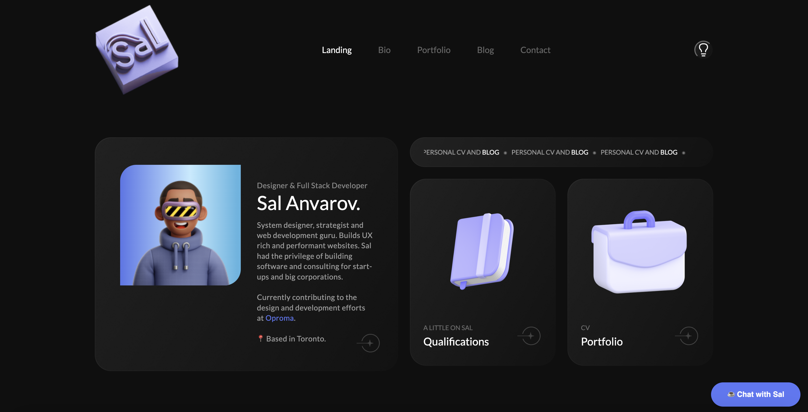

<h1 align="center">Sal's Personal Portfolio Website</h1>

<p align="center">
  <a href="https://www.sal-anvarov.com/" target="_blank"></a>
</p>

<p align="center">A modern <a href="https://vitejs.dev" target="_blank" rel="noreferrer noopener">Vite</a> + <a href="https://react.dev" target="_blank" rel="noreferrer noopener">React 18</a> portfolio site by Sal Anvarov. Optionally wired up to <a href="https://www.hotjar.com/" target="_blank" rel="noreferrer noopener">HotJar</a>, <a href="https://tagmanager.google.com/#/home" target="_blank" rel="noreferrer noopener">GTM</a>, and <a href="https://formspree.io/" target="_blank" rel="noreferrer noopener">Formspree</a> via environment variables.
</p>

<p align="center">
  <a href="https://app.netlify.com/start/deploy?repository=https://github.com/msanvarov/personal-portfolio">
    
  </a>
  &nbsp;
  <a href="https://vercel.com/new/clone?repository-url=https%3A%2F%2Fgithub.com%2Fmsanvarov%2Fpersonal-portfolio&project-name=personal-portfolio&repository-name=personal-portfolio&env=VITE_ENABLE_TRACKING,VITE_HOTJAR_WEBSITE_UID,VITE_HOTJAR_VERSION,VITE_GOOGLE_TAG_MANAGER_UID,VITE_MICROSOFT_CLARITY_UID,VITE_DEBUGBEAR_RUM_UID,VITE_FORMSPREE_FORM_ID,VITE_DISQUS_SHORTNAME,VITE_CALENDLY_URL,VITE_SITE_URL&envDescription=VITE_-prefixed%20integration%20IDs.%20All%20optional%20%E2%80%94%20see%20.env.example.&envLink=https%3A%2F%2Fgithub.com%2Fmsanvarov%2Fpersonal-portfolio%23-environment-configuration&demo-title=Sal%20Anvarov&demo-url=https%3A%2F%2Fwww.sal-anvarov.com">
    
  </a>
</p>

Table of contents:

1. [Description](#description)
2. [Prerequisites](#prerequisites)
3. [Deployment](#deployment)
4. [Environment configuration](#environment-configuration)
5. [SEO and AI-SEO](#seo-and-ai-seo)
6. [Repository layout](#repository-layout)
7. [Testing](#testing)

### Description

Preview: https://www.sal-anvarov.com/

This portfolio site was rebuilt on Vite + React 18 + TypeScript with TanStack Router for client-side routing. Case studies and blog posts live as MDX files under `content/` and are bundled at build time via `@mdx-js/rollup` + `import.meta.glob`. State management is Redux Toolkit with `redux-persist`; styling is SCSS + Bootstrap 5 + Iconoir; animations use Framer Motion + AOS.

All third-party identifiers (Hotjar, GTM, Microsoft Clarity, DebugBear, Formspree, Disqus, Calendly) are read from `VITE_*` environment variables — nothing is hardcoded. Integrations gracefully no-op when their env var is not set.

---

### Prerequisites

- [Node.js](https://nodejs.org/en/download/) 20+
- [npm](https://www.npmjs.com/) 9+ (or pnpm / yarn)

Optional integrations:

- [HotJar](https://www.hotjar.com/)
- [Google Tag Manager](https://www.marketingplatform.google.com)
- [Microsoft Clarity](https://clarity.microsoft.com)
- [DebugBear RUM](https://www.debugbear.com/docs/rum/real-user-monitoring)
- [Vercel Analytics](https://vercel.com/docs/analytics/quickstart)
- [Formspree](https://formspree.io) (contact form)
- [Disqus](https://disqus.com) (blog comments)
- [Calendly](https://calendly.com) ("Chat with Sal" CTA)

---

### Deployment

#### One-click deploy

[](https://app.netlify.com/start/deploy?repository=https://github.com/msanvarov/personal-portfolio) [](https://vercel.com/new/clone?repository-url=https%3A%2F%2Fgithub.com%2Fmsanvarov%2Fpersonal-portfolio&project-name=personal-portfolio&repository-name=personal-portfolio&env=VITE_ENABLE_TRACKING,VITE_HOTJAR_WEBSITE_UID,VITE_HOTJAR_VERSION,VITE_GOOGLE_TAG_MANAGER_UID,VITE_MICROSOFT_CLARITY_UID,VITE_DEBUGBEAR_RUM_UID,VITE_FORMSPREE_FORM_ID,VITE_DISQUS_SHORTNAME,VITE_CALENDLY_URL,VITE_SITE_URL&envDescription=VITE_-prefixed%20integration%20IDs.%20All%20optional%20%E2%80%94%20see%20.env.example.)

The repo ships with both a `netlify.toml` and a `vercel.json` configured for a Vite SPA: build with `npm run build`, publish `dist/`, and add a `/* -> /index.html` rewrite so the router handles deep links. See [Netlify deploy docs](https://docs.netlify.com/deploy/create-deploys/) and [Vercel deploy docs](https://vercel.com/docs/deployments/overview).

#### Local development

```bash
git clone https://github.com/msanvarov/personal-portfolio
cd personal-portfolio
cp .env.example .env.local   # fill in the integrations you actually use
npm install
npm run dev                  # http://localhost:4200
```

#### Build

```bash
npm run build      # type-check + production bundle to ./dist
npm run preview    # serve the production bundle locally
```

---

### Environment configuration

Vite only exposes variables prefixed with `VITE_` to the client. All integrations are optional — if the env var is missing or `VITE_ENABLE_TRACKING` is not `true`, the associated script simply will not load.

| Variable                       | Purpose                                          |
| ------------------------------ | ------------------------------------------------ |
| `VITE_ENABLE_TRACKING`         | Master switch for analytics. `true` / `false`.   |
| `VITE_HOTJAR_WEBSITE_UID`      | Hotjar site ID                                   |
| `VITE_HOTJAR_VERSION`          | Hotjar script version (typically `6`)            |
| `VITE_GOOGLE_TAG_MANAGER_UID`  | GTM / GA4 measurement ID                         |
| `VITE_MICROSOFT_CLARITY_UID`   | Clarity project ID                               |
| `VITE_DEBUGBEAR_RUM_UID`       | DebugBear RUM script ID                          |
| `VITE_FORMSPREE_FORM_ID`       | Formspree form ID for `/contact`                 |
| `VITE_DISQUS_SHORTNAME`        | Disqus shortname for blog comments (optional)    |
| `VITE_CALENDLY_URL`            | Calendly URL for the "Chat with Sal" popup       |
| `VITE_SITE_URL`                | Canonical site URL used in OG metadata           |

> No secrets ever ship to the client by design — these are all public IDs intended to be read at runtime by their respective scripts. Still, keep your real `.env.local` out of version control (it is git-ignored).

---

### SEO and AI-SEO

The site ships ready for both classic search-engine indexing and AI-crawler discovery:

- **`/robots.txt`** — explicit `Allow: /` for Googlebot, Bingbot, DuckDuckBot, Applebot, Yandex, Baidu, plus AI crawlers (GPTBot, OAI-SearchBot, ChatGPT-User, ClaudeBot, Claude-Web, anthropic-ai, PerplexityBot, Google-Extended, Meta-ExternalAgent, Amazonbot, Bytespider, YouBot, Mistral-AI-User). Edit any user-agent block to `Disallow: /` to opt out.
- **`/sitemap.xml`** — generated at build time from the static routes plus every MDX file under `content/case-studies/` and `content/posts/`, with `lastmod` taken from frontmatter or file mtime.
- **`/llms.txt`** — curated index (per the [llmstxt.org](https://llmstxt.org) convention) that lists each portfolio entry and blog post with a one-line summary, so AI agents that respect the file can fetch a clean table of contents.
- **Per-route metadata** — unique `<title>`, `<meta name="description">`, `<link rel="canonical">`, Open Graph, Twitter Card, and JSON-LD on every route. Case studies emit `CreativeWork`, blog posts emit `BlogPosting`, list pages emit `ItemList`/`Blog`, and detail pages add `BreadcrumbList`.
- **Static-HTML JSON-LD** — `index.html` embeds a Person + WebSite `@graph` so non-JS-rendering crawlers see Sal's identity on the first byte without waiting for hydration.

When the canonical URL changes, update `VITE_SITE_URL` and the hardcoded `https://www.sal-anvarov.com` references in `public/robots.txt`, `public/llms.txt`, and `index.html`.

---

### Repository layout

```text
.
├── content/
│   ├── case-studies/     # portfolio MDX entries
│   └── posts/            # blog MDX entries
├── public/               # static assets served from /
├── src/
│   ├── components/       # Layout, Header, Footer, BlogNavbar, ...
│   ├── i18n/             # English copy (JSON)
│   ├── pages/            # page components (rendered by routes/)
│   ├── providers/        # ThemeProvider
│   ├── routes/           # TanStack Router file-based routes
│   ├── store/            # Redux Toolkit slices + hooks
│   ├── styles/           # global SCSS (dark + light)
│   ├── utils/            # tracking, content loader, themed assets, SEO
│   ├── App.tsx
│   ├── main.tsx
│   ├── router.ts
│   └── vite-env.d.ts
├── index.html
├── netlify.toml
├── package.json
├── tsconfig.json
├── vercel.json
└── vite.config.ts
```

---

### Testing

```bash
npm run lint        # eslint
npm run typecheck   # tsc --noEmit
```

---

### Help

PRs are appreciated.

---

## License

This personal portfolio website is [MIT licensed](LICENSE).

[Author](https://linkedin.com/in/sal-anvarov)
